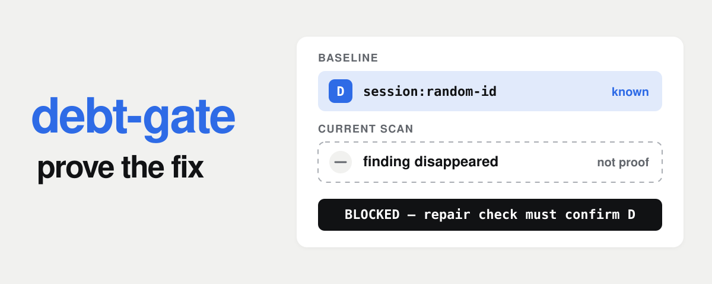
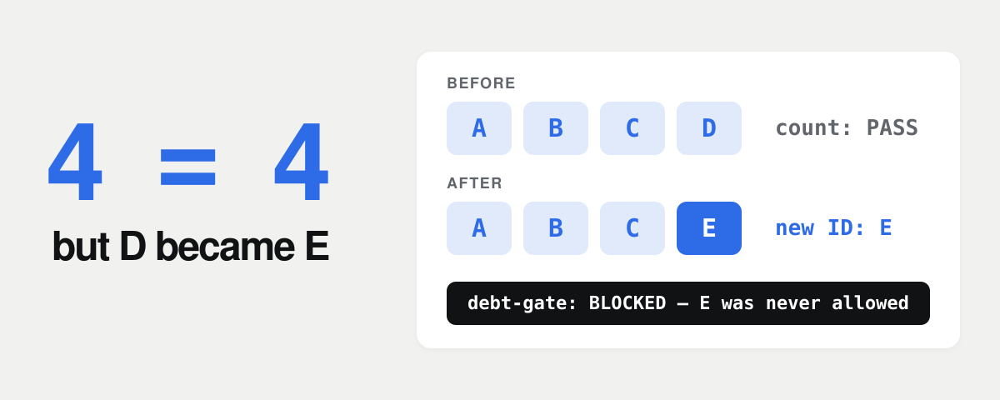
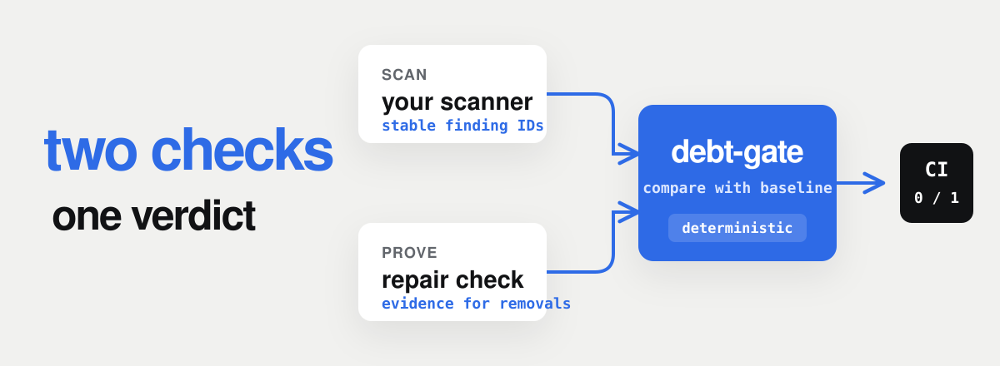
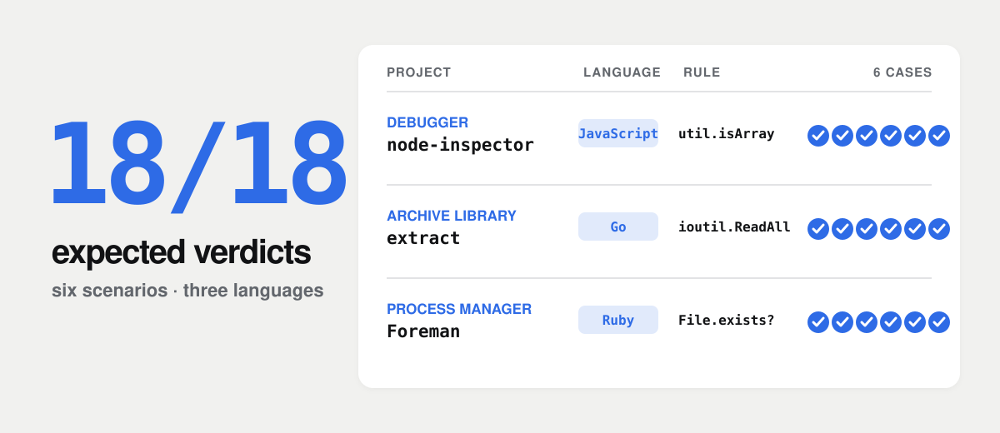

<p align="center">
  
</p>

<h3 align="center">Keep a technical-debt backlog from growing.</h3>

<p align="center">
  Most repositories have known problems they can't fix all at once.<br>
  Debt-gate records that backlog, rejects new problems,<br>
  and checks that removed problems were actually fixed.
</p>

<p align="center">
  Node.js 20+ · Git · no runtime dependencies<br>
  By Pavel Rabtsevich · <a href="https://x.com/p_rabtsevich"><b>@p_rabtsevich</b></a>
</p>

<p align="center">
  <a href="https://github.com/ipaulsmith/debt-gate/actions/workflows/ci.yml"></a>
  <a href="#tested-on-real-repositories"></a>
  
  <a href="./LICENSE"></a>
</p>

<p align="center">
  <a href="#install-with-an-ai-coding-agent">Install</a> ·
  <a href="#how-it-works">How it works</a> ·
  <a href="#tested-on-real-repositories">Field tests</a> ·
  <a href="#ci-and-trust">CI and trust</a>
</p>

## The problem

A repository may have hundreds of known problems. Blocking every change is not practical, but allowing the number to grow makes the backlog worse.

A count does not solve this. Fix one old problem, add a different one, and the total stays the same: **4 before → 4 after**.

<p align="center">
  
</p>

Debt-gate records the ID of every problem.

| What happens | Result |
|---|---|
| Existing debt stays | Allowed |
| New debt appears | Blocked |
| You fix an old problem | Prove it, then run `accept` |
| A fixed problem comes back | Blocked |
| A problem disappears | Blocked until the repair check proves the fix |

That is the full rule: existing IDs may remain, new IDs fail, and a missing existing ID needs repair evidence.

Debt-gate is not a linter. It runs checks that you provide.

## Install with an AI coding agent

Paste this prompt into Claude Code, Codex, Cursor, or another coding agent:

```text
Install debt-gate in this repository. Start with:

npm install --save-dev debt-gate

Inspect the repository before changing anything. Reuse an existing deterministic
scanner if it can report stable IDs for the problems we want to track. Otherwise,
write the smallest adapter needed to produce debt-gate JSONL. Write a separate
repair command that tests the repaired behavior; deleting code or hiding a finding
must not count as a repair. If you combine scanners, namespace their IDs with the
scanner name, for example `eslint:...` or `semgrep:...`.

Run `npx debt-gate init` on the current base branch with the scanner, repair
command, and every repository file they depend on. Keep the package files,
`.debt-gate/config.json`, `.debt-gate/baseline.json`, the adapter, the repair
command, and their policy files.

Add `npx debt-gate check --base origin/main` to the existing CI workflow. Keep the
current CI setup and use full Git history (`fetch-depth: 0`). Do not create a second
workflow if the repository already has one.

Do not weaken existing checks or change application behavior to make the gate pass.
Run the scanner, repair check, debt-gate check, and the repository's existing tests.
Show the files you changed and the commands that passed. If the repository has no
suitable deterministic check or a repair cannot be proved independently, stop and
explain what is missing instead of inventing a weak check.
```

## Run the included example

This example replaces a random session ID with a stable account ID:

```diff
- identity.randomSessionId()
+ identity.stableAccountId(account)
```

A second check calls the function and confirms that it returns the right ID. Deleting the function does not pass that check.

From a debt-gate checkout, you can run the example with Node.js 20+, npm, and Git.

<details>
<summary><b>Run the complete example</b></summary>

From the debt-gate checkout, run:

```sh
demo_dir=$(mktemp -d)
cp -R examples/deprecated-api/. "$demo_dir/"
cd "$demo_dir"
npm init -y
npm install --no-audit --no-fund debt-gate
git init -b main

npx debt-gate init --scanner scanner.mjs \
  --repair repair.mjs \
  --trust migration-rules.json \
  --trust js-tokens.mjs
git add .debt-gate src scanner.mjs repair.mjs \
  migration-rules.json js-tokens.mjs
git commit -m "Record existing session-ID debt"
git switch -c migrate-session
npx debt-gate check --base main
```

The first check passes because `session:random-id` is already in the baseline. Now replace `src/session.js` with:

```js
export function createSession(account, identity) {
  return { id: identity.stableAccountId(account), account };
}
```

The next check exits 1. The repair check passed, but debt-gate waits for you to record the change with `accept`.

```sh
npx debt-gate check --base main   # Exit 1
npx debt-gate accept --base main
git add src/session.js .debt-gate/baseline.json
git commit -m "Use stable session IDs"
npx debt-gate check --base main   # Exit 0
```

Put `identity.randomSessionId()` back and the check fails.

</details>

## How it works

Debt-gate needs two commands from your repository:

1. A **scanner** reports the problems present now.
2. A **repair check** tests whether a missing known problem was actually fixed.

Both commands can be written in any language. They must return the same result for the same input.

<p align="center">
  
</p>

The scanner can call ESLint, Ruff, Semgrep, grep, or your own script. Debt-gate does not bundle these tools. If necessary, add a small adapter that converts their output to the format below.

On the base branch, run `init` and commit the generated files with the commands they use:

```sh
npx debt-gate init --scanner scanner.mjs \
  --repair repair.mjs \
  --trust policy.json
```

- `.debt-gate/config.json` stores the commands and trusted files.
- `.debt-gate/baseline.json` stores the problem IDs that already exist.

On a feature branch, run:

```sh
npx debt-gate check --base origin/main
```

If the repair check confirms a fix, record the smaller baseline and commit it with the code:

```sh
npx debt-gate accept --base origin/main
git add .debt-gate/baseline.json
```

`accept` stops if the branch still contains another gate violation.

### Scanner

You own the finding IDs. Give every problem an ID that stays the same when the code is edited or moved. Never reuse an ID for a different problem.

If you combine scanners, give each one a namespace so their IDs cannot collide: `eslint:...`, `semgrep:...`, `ruff:...`.

Print one JSON object per problem. Only `id` is required. JSONL puts each object on one line; the example is expanded for readability.

```json
{
  "id": "session:random-id",
  "path": "src/session.js",
  "message": "Random session ID"
}
```

### Repair command

When a known problem disappears, debt-gate sends its ID to the repair command on stdin: `{"ids":["session:random-id"]}`. If the command confirms the fix, it prints:

```json
{
  "id": "session:random-id",
  "repaired": true,
  "evidence": "Returns stable ID"
}
```

The repair command must test the new behavior, not merely check that the old code is gone. A successful result needs `repaired: true` and non-empty `evidence`. If the command cannot prove the fix, it should print nothing for that ID.

Debt-gate trusts this output. The proof is only as reliable as the repair command that produced it.

Both commands must exit 0 after printing their results. If a scanner normally exits non-zero when it finds problems, handle that in the adapter. Real execution errors must still fail the run. See the [working example](examples/deprecated-api).

## What debt-gate does not do

- It does not find problems. Your scanner does that.
- It does not decide whether an existing problem is acceptable.
- It does not verify the repair command itself. A weak repair command can approve a bad fix.
- It does not sandbox the scanner or repair command.
- It cannot protect a compromised base branch, CI workflow, dependency, runtime, or machine.

## Tested on real repositories

We ran debt-gate against fixed snapshots of three unrelated repositories: a JavaScript debugger, a Go archive library, and a Ruby process manager.

Each repository went through six cases: unchanged debt, new debt, file deletion, a same-count swap, a proved repair, and a repaired problem returning.

<p align="center">
  
</p>

| Project | Existing problem | Result |
|---|---|---:|
| node-inspector · JavaScript debugger | Deprecated `util.isArray` | 6/6 |
| extract · Go archive library | Deprecated `ioutil.ReadAll` | 6/6 |
| Foreman · Ruby process manager | Deprecated `File.exists?` | 6/6 |

The field policies use text matching. They test debt-gate's decisions, not the applications themselves. The projects did not participate in the tests. [Results and source commits](https://github.com/ipaulsmith/debt-gate/blob/main/docs/field-trials.md) · [Reproduce the run](https://github.com/ipaulsmith/debt-gate/tree/main/field-tests).

## CI and trust

Do not let a feature branch replace the rules that check it. Keep the workflow and base branch protected, fetch the full Git history, and pass the base explicitly: `--base origin/main`.

For stronger isolation, install an exact reviewed version of debt-gate outside the checkout and run it by absolute path. Debt-gate rejects branch changes to its configuration, trusted files, and recorded baseline.

- List every repository file used by the scanner or repair command in `trustedPaths`, including imported helpers.

<details>
<summary>CI setup</summary>

Check out the repository with `fetch-depth: 0`. Install an exact reviewed version during trusted CI setup:

```sh
: "${RUNNER_TEMP:?Set the runner temporary directory}"
npm install --global --prefix "$RUNNER_TEMP/debt-gate" debt-gate@0.1.0
git fetch --no-tags origin main:refs/remotes/origin/main
"$RUNNER_TEMP/debt-gate/bin/debt-gate" check --base origin/main
```

Install the scanner, repair command, and their dependencies during trusted setup. Before running them, debt-gate checks the declared configuration and policy against the base branch.

</details>

## Reference

<details>
<summary>Configuration and JSON protocols</summary>

Tell debt-gate which repository files affect the checks. `init` adds the scanner and repair command to `trustedPaths`; add their helpers and policy files with repeated `--trust` flags. Feature branches cannot change the content, file type, or executable bit of those files. Change them on the protected base branch. `init` never overwrites an existing baseline.

The example generates `.debt-gate/config.json`:

```json
{
  "schemaVersion": 1,
  "scanner": { "command": ["node", "scanner.mjs"], "format": "jsonl" },
  "repair": { "command": ["node", "repair.mjs"], "format": "jsonl" },
  "trustedPaths": [
    "js-tokens.mjs", "migration-rules.json", "repair.mjs", "scanner.mjs"
  ]
}
```

Debt-gate runs command arrays directly, without a shell. Put arguments in the arrays. JSONL is the default format. With `init --format json`, a command may return an array, `{"findings":[]}`, or `{"repairs":[]}`. Duplicate or malformed records fail the run.

</details>

<details>
<summary>Git history and its limits</summary>

Debt-gate reads the starting rules and baseline from the common ancestor of `HEAD` and `--base`. Git calls this commit the **merge-base**. It is not always the latest commit on the base branch.

If you omit `--base`, debt-gate tries `origin/HEAD`, `origin/main`, and `main`. It stops if those refs have diverged. Shallow clones do not contain enough history and are rejected.

An ID remains allowed only while it appears in every relevant baseline reachable from the branch. Removing an ID tightens the baseline; restoring it later does not reopen space for that debt. Deleting the baseline counts as removing every ID. Independent repairs on sibling branches can still merge.

The history check reads baseline files, not every old version of the source. The repair command checks the code as it exists now.

A force-push or squash can remove commits from Git history. Debt-gate cannot use a commit that is no longer reachable unless its smaller baseline already reached the protected base branch.

</details>

<details>
<summary>Staged checks, machine output, and exit codes</summary>

```sh
npx debt-gate check --base main --staged
npx debt-gate check --base main --json
```

Use `--staged` to check the Git index. Debt-gate copies it to a temporary directory and runs both commands there. Untracked files and the checkout's `node_modules` are not copied, so use self-contained commands or dependencies installed elsewhere. `accept` changes the worktree baseline and cannot be combined with `--staged`.

A normal check reads the working tree. Use staged mode or an isolated checkout when you need a fixed snapshot.

Use `--json` for machine-readable output. It prints one JSON document with the verdict, counts, changes, repair evidence, and error details.

| Exit | Meaning |
|---:|---|
| 0 | Accepted |
| 1 | Violation or proved improvement awaiting `accept` |
| 2 | Usage or configuration error |
| 3 | Git authority or trusted-policy failure |
| 4 | Scanner, repair, or internal failure |

</details>

## Testing and development

[CI](https://github.com/ipaulsmith/debt-gate/actions/workflows/ci.yml) runs the adversarial suite and installs the release package on **Ubuntu and macOS with Node 20, 22, and 24**. Other platforms have not been tested.

```sh
# From the debt-gate checkout
npm test
npm run pack:check
```

MIT · [Issues](https://github.com/ipaulsmith/debt-gate/issues)
